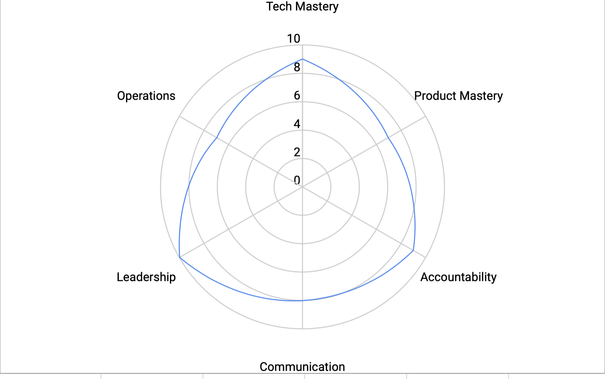

# Management Skills 

* __Tech Mastery__: general knowledge of the profession, with specialization in specific fields that are relevant to your team’s expertise. This is very important to a manager of engineering teams, you need to speak the same language and being able to understand each conversation your team will have with you. It will put in a spot where you can evaluate correctly all the information you received and at the same time you will build trust from your people.

* __Product Mastery__: the difference between just any random manager and a manager within your company is that they have to also have a good understanding of your product space, the market, the users, the jargon, the competitors, etc.

* __Accountability__: how well you can keep track of tasks and promises, as well as gain and maintain trust with the rest of the organization. When you say you’ve got something, how likely is the other person to completely trust you ? You will be required to spot any risk, to provide mitigation plans, and/or being able to make trade-offs.

* __Communication__: Another amalgamation of smaller skills. Communication includes being able to convey their thoughts to their team as well as non-technical peers. It can also span to other areas that might matter more or less to you, such as public speaking.

* __Leadership__: Having executive mindset, instilling purpose, and having a growth mindset, and willing to coach team members. 

* __Operations__: Effective leaders are careful to get their team operating efficiently. This covers many areas:    
    * The ability to provide their reports with autonomy and agency to do things on their own, delegating things where it makes sense. 
    * Having meeting in excellent order. This means they master the type, frequency and content of their most important meetings. At “leading a team” stage, the most important meetings include: 1:1s, team meetings, and offsite. 
    * Leaders must know how to execute on key practices such as performance reviews, compensation setting, goal management, leaves of absence, role transfers, promotions, hiring, terminations, and career development. 
    * The leader should have a vision and strategy for team performance. Regardless of approach, the leader must understand each individual’s strengths and weaknesses, coach for high performance, and manage under-performance.
    * Optimizing the structure of each role, be proactive and strategic in how they structure the work for each individual and role.

Equipped with this list and the expected level for each of the skills for the different roles, it’s time to sit down and assess where you believe the manager is for each. One way to do this is to create a [radar chart](https://en.wikipedia.org/wiki/Radar_chart) where you can more easily spot where you should be spending your attention. 

